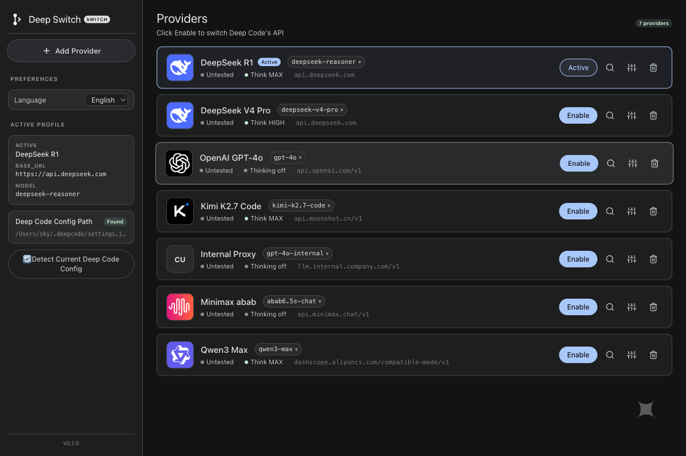

# Deep Switch

> 한 번의 클릭으로 **Deep Code** CLI의 AI 공급자를 전환하는 메뉴 막대 / Dock 유틸리티.
> 설정 파일을 열 필요 없음. 재시작도 필요 없음. 몇 초 만에 전환.

---

## 다운로드 / Download

**최신 안정판:** [v0.1.1](../../releases/latest)

**macOS 권장 설치 방법（Gatekeeper 경고 없음, `brew upgrade`로 업데이트 가능）:**

```bash
brew install --cask skyedolyn-sys/deep-switch/deep-switch
```

| 플랫폼 | 다운로드 | 크기 |
|---|---|---|
| macOS (Apple Silicon) | [`deep-switch_0.1.1_aarch64.dmg`](../../releases/download/v0.1.1/deep-switch_0.1.1_aarch64.dmg) | ~5 MB |
| macOS (Apple Silicon) | [`deep-switch_0.1.1_aarch64.zip`](../../releases/download/v0.1.1/deep-switch_0.1.1_aarch64.zip) | ~5 MB |
| Linux (deb) | [`deep-switch_0.1.1_amd64.deb`](../../releases/download/v0.1.1/deep-switch_0.1.1_amd64.deb) | ~6 MB |
| Linux (AppImage) | [`deep-switch_0.1.1_amd64.AppImage`](../../releases/download/v0.1.1/deep-switch_0.1.1_amd64.AppImage) | ~80 MB |
| Windows (MSI) | [`deep-switch_0.1.1_x64_en-US.msi`](../../releases/download/v0.1.1/deep-switch_0.1.1_x64_en-US.msi) | ~5 MB |
| Windows (NSIS .exe) | [`deep-switch_0.1.1_x64-setup.exe`](../../releases/download/v0.1.1/deep-switch_0.1.1_x64-setup.exe) | ~5 MB |

> ⚠️ **macOS 수동 설치(dmg/zip): 빌드는 애드혹 서명으로 공증되어 있지 않아** 첫 실행 시 「손상되어 열 수 없습니다」라고 오표시될 수 있습니다. 삭제하지 마세요 — 파일은 정상입니다. 둘 중 하나로 해제할 수 있습니다:
> 1. **dmg / 압축 해제 폴더의 【安装说明 Installation Guide.txt】를 열어 3단계를 복사·붙여넣기**(명령어 지식 불필요), 또는
> 2. 터미널에서 한 번 `xattr -cr /Applications/deep-switch.app` 실행 후 다시 열기.
>
> Homebrew cask는 이 단계를 자동으로 처리합니다 — 그래서 권장 설치 방법입니다. 검증된 Apple Developer ID를 확보하는 대로 공증된 릴리스로 전환할 예정입니다.
>
> Linux: AppImage는 설치 없이 그대로 실행 가능한 포터블 포맷이고, `.deb`는 Debian/Ubuntu용입니다. Windows: MSI는 시스템 전역 설치용, NSIS `.exe`는 사용자별 포터블 설치용입니다.

---

## 언어 / Languages

- [English](../README.md)
- [简体中文](../README.zh-CN.md)
- [繁體中文](../README.zh-TW.md)
- [日本語](../README.ja.md)
- [한국어](../README.ko.md)

---

<div align="center">

```
██████╗  ███████╗███████╗██████╗     ███████╗██╗    ██╗██╗████████╗ ██████╗██╗  ██╗
██╔══██╗██╔════╝██╔════╝██╔══██╗    ██╔════╝██║    ██║██║╚══██╔══╝██╔════╝██║  ██║
██║  ██║█████╗  █████╗  ██████╔╝    ███████╗██║ █╗ ██║██║   ██║   ██║     ███████║
██║  ██║██╔══╝  ██╔══╝  ██╔═══╝     ╚════██║██║███╗██║██║   ██║   ██║     ██╔══██║
██████╔╝███████╗███████╗██║         ███████║╚███╔███╔╝██║   ██║   ╚██████╗██║  ██║
╚═════╝ ╚══════╝╚══════╝╚═╝         ╚══════╝ ╚══╝╚══╝ ╚═╝   ╚═╝    ╚═════╝╚═╝  ╚═╝
```

**Deep Code CLI의 공급자 전환기 —— 실제 업무 흐름에 맞게 설계.**

[](../LICENSE)
[](#설치)
[](https://tauri.app)
[](https://react.dev)
[](https://www.rust-lang.org)

</div>

---

## 스크린샷

<p align="center">
  
</p>

---

## Deep Switch란?

Deep Switch는 macOS용 작은 메뉴 막대 / Dock 유틸리티(Linux 및 Windows에서는 시스템 트레이 유틸리티)로, `~/.deepcode/settings.json`을 편집하여 **Deep Code** CLI가 현재 어떤 AI 공급자와 통신하고 있는지를 즉시 전환할 수 있게 해 줍니다. 공급자를 한 번 등록해두면, JSON 파일을 열지 않고서도 한 번의 클릭으로 전환할 수 있습니다.

Deep Code의 대체물이 아니라, **Deep Code를 위한** 미러/호환 유틸리티입니다. Deep Code 자체는 건드리지 않으며, CLI가 다음 호출에서 읽을 설정 파일만 다시 씁니다.

---

## 왜 필요한가?

여러 공급자를 오가며 일하는 게 이렇게 힘들어야 할 이유가 없습니다.

- 🧩 **공급자가 너무 많고, 키도 너무 많습니다** — DeepSeek, Moonshot, Zhipu GLM, MiniMax, ByteDance Doubao, SiliconFlow, OpenRouter, OpenAI, Groq, SenseTime SenseNova, Tsinghua DeepSeek-R1… 각각 고유한 Base URL, 모델 이름, 함정이 있습니다.
- 📝 **`settings.json` 수동 편집** — 한 글자만 잘못 입력하거나 쉼표를 빠뜨리면 JSON이 깨집니다.
- 🐢 **전환이 너무 느립니다** — CLI 종료, 파일 편집, 재시작, 대기, 반복.
- 💾 **백업 상태가 사라집니다** — 덮어쓰면 이전 설정은 영원히 되돌릴 수 없습니다.
- 🔁 **반복 작업** — 새 프로젝트마다 같은 작업을 다시 합니다.

Deep Switch는 이 모든 것을 한 번의 클릭으로 정리합니다.

---

## 기능

- ⚡ **한 번의 클릭으로 활성화** — 공급자를 선택하고 *활성화*를 누르면 끝.
- 📦 **사전 설정 폭넓은 커버리지** — DeepSeek · Moonshot/Kimi · Zhipu GLM · MiniMax · ByteDance Doubao · SiliconFlow · OpenRouter · OpenAI · Groq · SenseTime SenseNova · Tsinghua DeepSeek-R1 (671B 풀 + 32B 디스틸, 둘 다 사전 설정 카드에서 선택 가능), 그리고 완전히 사용자 정의 가능한 *Custom* 슬롯.
- 🔄 **실시간 반영** — `~/.deepcode/settings.json`을 직접 다시 씁니다. 다음에 CLI를 호출하는 시점에 이미 새 공급자로 전환되어 있습니다. **재시작 불필요.**
- 🌐 **OpenCode 동기화** — 동일한 공급자를 `~/.config/opencode/opencode.json`에도 함께 기록하여, opencode-ai CLI가 `@ai-sdk/openai-compatible` 어댑터를 통해 그대로 사용할 수 있게 합니다. 같은 공급자, 두 개의 클라이언트.
- 🧠 **모델 선택기** — 공급자의 `/v1/models` 엔드포인트에서 실시간으로 모델 목록을 가져와, 실제로 사용 가능한 것만 선택할 수 있습니다.
- 🤔 **사고 모드 전환** — 체인 오브 씽킹을 활성화하고 추론 깊이 `high` / `max`를 선택할 수 있습니다.
- 🛰️ **캠퍼스 / WAF 대응 프록시** — 엄격한 WAF 뒤에 있는 공급자(예: Tsinghua의 madmodel.cs.tsinghua.edu.cn)를 위해, Deep Switch는 내장된 Node.js 헬퍼(`scripts/tsinghua-proxy.mjs`)를 실행시켜 일시적인 404에 자동 재시도하고, `<think>` 추론 부분을 별도의 `reasoning_content` 델타로 분리하며, 재시도 중에도 경고 청크를 클라이언트로 스트리밍하여 CLI가 멈춘 것처럼 보이지 않게 합니다.
- 🪟 **닫을 때 트레이로 숨김** — 창을 닫아도 앱은 메뉴 막대에서 계속 살아 있고, 트레이 아이콘을 우클릭하면 종료할 수 있습니다.
- 🌐 **이중 언어 UI** — 한국어와 영어, 시스템 로케일 자동 감지 + 수동 오버라이드.
- 📌 **트레이 메뉴로 즉시 전환** — 트레이 아이콘을 우클릭하여 메인 창을 열지 않고 전환. 메뉴 표기는 UI 언어에 따름. 상태는 `active-provider-changed` 이벤트를 통해 메인 창에 다시 동기화됩니다.
- 🪄 **최초 "현재 설정 감지" 가져오기** — Deep Code가 현재 가리키는 것을 읽어 한 번의 클릭으로 저장 가능한 공급자로 만듦.
- 🔒 **로컬 전용 자격 증명** — `~/.deep-switch/config.json`에 `0600` 권한으로 저장. 업로드, 동기화, 로그 저장 모두 없음.
- 🎯 **헬스 체크** — 선택적 경량 Base URL 프로브. CLI가 에러를 내기 전에 알 수 있음.
- 🪶 **경량** — 단일 트레이 아이콘, 시스템 WebView, 디스크 약 12 MB. Chromium 내장 없음, 백그라운드 데몬 없음.

---

## 동작 원리

```
┌──────────────────┐        ┌────────────────────────┐        ┌──────────────────────┐
│  사전 설정/      │  ───▶  │  메인 창이나 트레이      │  ───▶  │  ~/.deepcode/        │
│  사용자 정의     │        │  메뉴에서                 │        │  settings.json       │
│  (DeepSeek,      │        │  "활성화" 클릭          │        │  이(가) Tauri Rust    │
│  Moonshot, …)    │        │                        │        │  메인 프로세스에 의해 │
└──────────────────┘        └────────────────────────┘        │  다시 써짐.          │
                                                                  └──────────┬───────────┘
                                                                              │
                                                                              ▼
                                                                  ┌──────────────────────────┐
                                                                  │  다음 Deep Code CLI 호출이 │
                                                                  │  새 settings를 읽고,        │
                                                                  │  전환된 공급자와 통신함.    │
                                                                  └──────────────────────────┘
```

4 단계:

1. 공급자 **추가** (사전 설정을 선택하거나 Base URL + 키 붙여넣기)
2. 메인 창이나 트레이 메뉴에서 **활성화** 클릭
3. Deep Switch가 Tauri Rust 메인 프로세스를 통해 `settings.json`을 다시 씀
4. 다음에 Deep Code CLI를 호출하면 방금 저장된 파일을 읽음

이게 전부입니다.

---

## 설치

### macOS(권장)

**Homebrew(한 줄 명령, Gatekeeper 격리도 자동 처리):**

```bash
brew install --cask skyedolyn-sys/deep-switch/deep-switch
```

**또는 수동 설치:** [Releases](../../releases) 페이지에서 최신 `.dmg`를 다운로드하고 **Deep Switch**를 Applications 폴더로 드래그합니다.

> 빌드가 서명되지 않았으므로 DMG에서 처음 실행할 때 Gatekeeper 경고가 나타납니다. 우클릭 → *열기*로 허용하세요. Homebrew cask로 설치하면 `xattr -cr`이 자동으로 실행되어 이 단계를 건너뜁니다.

### Linux 및 Windows

이제 공식 설치 프로그램을 제공합니다 — 위 [다운로드](#다운로드--download) 표를 참고해 주세요.

**Linux — 어떤 파일을?**

- **`.deb`**(Debian / Ubuntu): 약 4 MB, 시스템 전역 설치, `sudo` 필요. `apt`를 통해 시스템의 WebKitGTK를 사용합니다. `sudo dpkg -i deep-switch_0.1.1_amd64.deb`로 설치(대부분의 데스크톱 파일 관리자에서 더블클릭도 가능).
- **`.AppImage`**(모든 배포판, root 불필요): 약 80 MB, 완전한 자체 포함 — WebKitGTK를 함께 번들하므로 Arch / Fedora / openSUSE에서 추가 시스템 라이브러리 없이 실행됩니다. `chmod +x deep-switch_0.1.1_amd64.AppImage && ./deep-switch_0.1.1_amd64.AppImage`로 실행하거나 더블클릭. 크기가 큰 것은 이식성의 대가이며, 모든 의존성이 파일 안에 들어 있습니다.

그래도 소스에서 실행하고 싶다면:

```bash
git clone https://github.com/skyedolyn-sys/deep-switch.git
cd deep-switch
npm install
npm run tauri dev
```

---

## 개발

요구 사항: **Node.js 20+** 및 **Rust 1.77+** (Tauri 2 툴체인).

```bash
# 클론
git clone https://github.com/skyedolyn-sys/deep-switch.git
cd deep-switch

# 의존성 설치 (저장소의 lockfile 사용)
npm install

# 개발 모드 — Vite + Tauri, HMR 포함
npm run tauri dev
# 렌더러만 (브라우저 미리보기, Tauri 없음):
npm run dev:renderer

# 렌더러 타입 체크
npx tsc --noEmit

# 현재 플랫폼용 프로덕션 빌드
npm run tauri build

# Lint
npm run lint
```

`npm run tauri dev`는 Vite를 `http://localhost:5173`에서 시작하고 Tauri WebView 창에서 엽니다. 렌더러는 HMR, `src-tauri/src/**` 변경 시 Rust는 자동 재컴파일.

---

## 기술 스택

| 계층            | 도구                                              |
| --------------- | ------------------------------------------------- |
| 셸              | **Tauri 2** (시스템 WebView 사용)                |
| 렌더러          | **React 18** + **TypeScript 5** + **Vite 5**     |
| 네이티브 백엔드 | **Rust 1.77+** (serde, reqwest, tauri-plugin-log) |
| WAF 헬퍼        | 내장 **Node.js** 서브프로세스 (`scripts/tsinghua-proxy.mjs`) — WAF 보호 공급자로 전환할 때만 실행되며, 투명한 재시도 + SSE 스트리밍 제공 |
| i18n            | **i18next** + `i18next-browser-languagedetector` |
| 공급자 아이콘   | **@lobehub/icons** (오픈소스 SVG 브랜드 팩)        |
| 로컬 저장       | `~/.deep-switch/config.json` (JSON, 원자적 쓰기)  |
| 영속화          | `~/.deep-switch/config.json` + `~/.deepcode/settings.json` + `~/.config/opencode/opencode.json` |

---

## 프로젝트 구조

```
deep-switch/
├── src/
│   └── renderer/               # React UI
│       ├── App.tsx
│       ├── components/         # ProviderCard, PresetSelector, ProviderDetail 등
│       ├── lib/                # vendor-icons.tsx (공유 모듈)
│       ├── locales/            # en.json, zh.json
│       ├── i18n.ts
│       └── global.css
├── src-tauri/                   # Tauri Rust 백엔드
│   ├── src/
│   │   ├── main.rs             # Tauri 진입점
│   │   └── lib.rs              # 15개의 #[tauri::command] IPC + 트레이 + DB
│   ├── icons/                   # 앱 아이콘 세트
│   ├── capabilities/           # Tauri 보안 정책
│   ├── tauri.conf.json         # 창 설정, identifier, 번들 설정
│   └── Cargo.toml
├── public/                      # 정적 자산 (트레이 아이콘 등)
├── docs/                        # 다국어 문서
├── .github/workflows/           # CI + 릴리스
│   ├── ci.yml
│   └── release.yml
├── tsconfig.json                # 렌더러 TS 설정
└── vite.config.mts
```

---

## 기여

PR 환영 — 주제를 집중하세요.

1. 저장소를 포크하고 토픽 브랜치를 만드세요 (`feat/<short-name>`, `fix/<short-name>`).
2. 푸시하기 전에 `npm run lint`와 `npx tsc --noEmit`를 실행.
3. PR은 *무엇을* 바꿨는지보다 **왜** 바꿨는지를 설명하세요.

**공급자 사전 설정을 추가**하려면 `src-tauri/src/lib.rs`의 `get_builtin_presets`를 수정하세요 — `description` / `descriptionEn` (및 platform, hint, homepageUrl)을 양 언어에 동기화하세요.
**번역을 추가**하려면 `src/renderer/locales/en.json`과 `src/renderer/locales/zh.json`을 동기화하여 수정하고, 키가 정확히 일치하도록 하세요.

---

## 보안 및 개인정보

- 🔐 **API 키는 `~/.deep-switch/config.json`에 로컬 저장** — 어떤 곳에도 업로드하지 않습니다. "우리" 같은 곳은 없습니다. Deep Switch에는 백엔드가 없습니다.
- 🚫 **분석, 원격 측정, 충돌 보고 없음** — 써드파티 스크립트 없음, 원격 설정 가져오기 없음.
- 🌐 **Deep Switch 자체가 생성하는 네트워크 트래픽**은 모델 선택기를 열 때의 선택적 `/v1/models` 가져오기와 선택적 헬스 체크뿐 — 모두 당신의 머신에서 선택한 공급자로 직접 갑니다.
- 🧪 **오픈소스** — 당신의 머신에서 실행되는 모든 바이트가 이 저장소에 있습니다. 자유롭게 감사하세요.

보안 문제를 발견하면 공개 이슈가 아니라 비공개 보안 권고로 제출해 주세요.

---

## 라이선스

[MIT](../LICENSE) © 2026 Deep Switch contributors.

---

## 감사의 말

Tauri, React, Vite, Rust, i18next의 메인테이너들에게 감사드립니다. 여러분의 노력 덕분에 이 앱은 쉽게 만들어질 수 있습니다.
